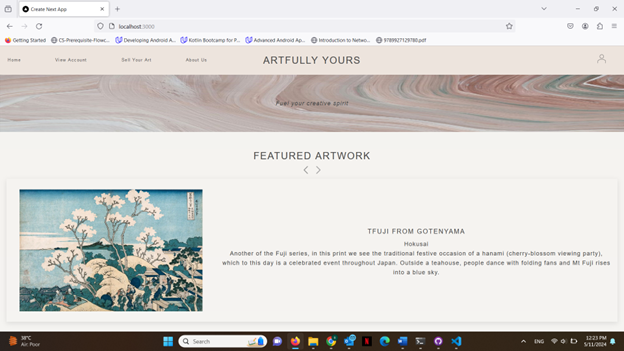
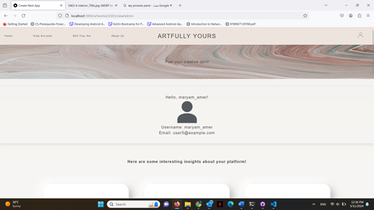
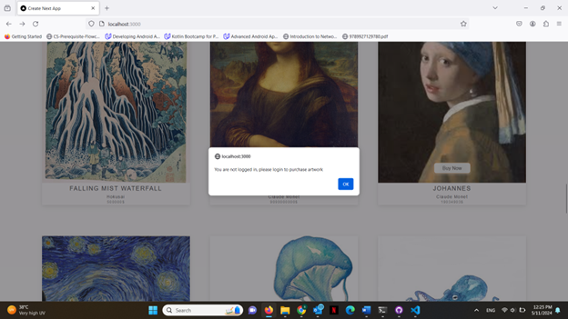

# E-Commerce Platform for Art Community

## Overview
This is an e-commerce platform designed to connect artists with art enthusiasts, enabling artists to sell their artworks and customers to purchase them. The platform includes multiple user roles, including **Admin**, **Customer**, and **Seller**, each with specific functionalities and views. The app features a user-friendly interface, a robust web API, and a simple data storage solution using JSON files.

## Features
- **Admin**: Admin users can manage artworks, update featured items, and view website statistics.
- **Customer**: Customers can browse artwork, add items to their cart, and complete purchases. They also have access to their purchase history and account details.
- **Seller**: Sellers can upload new artworks, manage their listings, and view the sales history of their artwork.
  
## Login Methods
The platform supports the following user roles, each with different login pages and functionalities:

1. **Admin Login**: Admin users can log in to manage artworks and access site-wide statistics.
   - Admins can change featured artwork, delete existing artwork listings, and view various website statistics.
   
2. **Customer Login**: Customers can log in to browse artwork, add items to their cart, and proceed to checkout.
   - Customers can view their purchase history and update their shipping details.

3. **Seller Login**: Sellers can log in to manage their artwork listings, view their sales history, and add new items for sale.
   - Sellers have access to the sales history for their specific artworks.

### Login Screens
- **Admin Login**: Provides access to administrative features, including the ability to modify artwork listings and view site statistics.
- **Customer Login**: Allows customers to purchase artwork, view their cart, and access their purchase history.
- **Seller Login**: Enables sellers to manage their artwork and see their sales data.

## Project Structure

### `CSS`
- Contains separate CSS files for different sections (e.g., `accountInfo.css`, `basket.css`, `checkout.css`), ensuring the app's design is modular and easy to maintain.

### `JS`
- Includes dynamic functionality for the app, such as adding items to the cart, processing checkout, and handling user login and registration.

### `DB`
- Data is stored in JSON files (`artwork.json`, `users.json`) and temporarily saved in local storage during the app's use.

### `Images`
- The `images` folder holds artwork images that are displayed throughout the app.

### `HTML Files`
- Basic structure and layout of the web pages, linking to the necessary CSS and JavaScript files to bring the app to life.

## Key Pages

- **Main Page**: Displays a list of artworks. Admin users can modify featured artwork.
- **Login Page**: Users can log in as either Admin, Seller, or Customer.
- **Artwork Page**: Shows detailed information about each artwork, including its price and description.
- **Checkout Page**: Customers can enter payment and shipping details for purchase.
- **Account Page**: Users can view their account details, including purchase history and order status.

## Data Model & Queries

The platform uses the following data models:
- **Users**: Representing Admin, Customer, and Seller roles.
- **Artwork**: Details of each piece of art available for purchase.
- **Purchase**: Tracks customer purchases, including artwork, quantity, and total price.
- **Bank Accounts**: Linked to sellers for managing transactions.

### Common Queries
- Add, update, and retrieve artworks.
- Add and retrieve purchases.
- Track statistics like top-selling artwork and most popular categories.
### Screenshots

